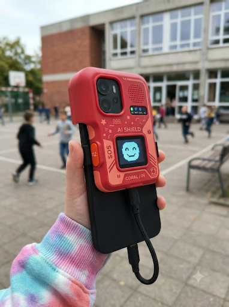
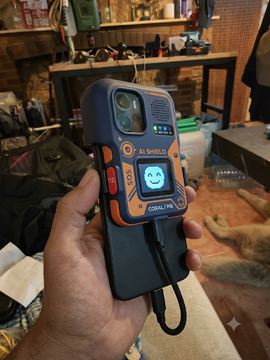

YAN

Personal Defence Against Unauthorised Device Activity

Independent observation. Physical verification. User control.

"Status" (https://img.shields.io/badge/status-prototype%20development-orange)
"Patent" (https://img.shields.io/badge/EPO-patent%20application%20filed-blue)
"Rights" (https://img.shields.io/badge/license-All%20Rights%20Reserved-red)

 
---

What is YAN?

YAN is an independent hardware-software protection system designed to observe, verify and record device activity from outside the environment being monitored.

Modern protection mechanisms usually operate inside the same device, operating system or software environment they are expected to supervise.

YAN introduces a second, independent point of observation.

The protected device can report what it is doing.

YAN can independently observe physical evidence of activity.

The two sources can then be correlated.

«Reported activity → Independent physical observation → Temporal correlation → Evidence»

YAN does not need to determine intent in order to identify a discrepancy.

---

The Principle

A system should not be the only source of information about its own behaviour.

An external YAN protective module may independently observe physical activity and compare it with information reported by the protected device or associated software.

When the two do not correspond, YAN may:

- record the event;
- preserve technical evidence independently;
- physically warn the user;
- perform a predefined protective action.

This creates an independent protective layer between reported digital state and physically observable activity.

---

Physical Protection

Depending on the implementation, YAN may provide:

Independent sensors

Physical observation of communication activity and other measurable events.

Independent storage

Recorded events may be preserved outside the primary software environment of the protected device.

Camera and sensor protection

Mechanical, optical or electro-optical means may physically protect cameras and other recording or monitoring sensors.

Hardware warning

Physical indicators may warn the user independently of the protected device's own display or software.

Hardware control

A physical hardware switch may perform a predefined protective action.

External Independent Module

Selected sensing, storage, power and control components may operate in a physically separate module.

---

---

Different Physical Forms

YAN is an architecture rather than a single fixed enclosure.

Possible implementations include:

- YAN Case / Full Cover
- YAN Cap / Shield
- YAN Kids
- YAN Pro / Business
- External Independent Module

The physical design may change while preserving the fundamental principle of independent observation and verification.

---

AI Systems

YAN can also monitor information associated with local or cloud-based artificial intelligence systems.

The system does not need to determine whether an AI system has good or bad intentions.

Its function is technical:

«Observe → Compare → Detect discrepancy → Preserve evidence → Protect»

---

Living Architecture

The analytical layer of YAN may use different software architectures.

Living Architecture represents one possible implementation for temporal representation and tracking of sequences and changes in actions and states.

YAN is not dependent on Living Architecture and is not limited to a particular analytical architecture or algorithm.

---

---

Patent Status

European Patent Application Filed — Patent Pending

A European patent application covering aspects of YAN technology has been filed with the European Patent Office (EPO).

The application includes aspects of:

- independent physical observation;
- correlation between reported device activity and independently obtained physical information;
- independent recording;
- physical protection mechanisms;
- hardware warning and control;
- modular protective architecture.

---

Project Status

YAN is currently under development.

Images presented in this repository are conceptual visualisations and do not represent a final production design.

Hardware configuration, enclosure geometry, sensors and implementation details may change during development.

---

Documentation

Additional non-confidential information about the architecture and objectives of YAN is provided separately in:

"PROJECT_OVERVIEW.md"

Certain implementation details and internal protective mechanisms are intentionally not included in the public documentation.

---

---

Intellectual Property

Copyright © 2026. All Rights Reserved.

This repository is not released under the MIT License or any other open-source licence.

Unless expressly authorised in writing, no licence is granted to reproduce, modify, manufacture, distribute, commercialise or create derivative implementations of the protected YAN technology or materials contained in this repository.

Certain aspects of YAN are the subject of a pending European patent application.

Public availability of documentation in this repository does not constitute a grant of patent rights, commercial rights or permission to implement the protected technology.

---

YAN

Independent evidence before assumption.

Physical control remains with the user.

European Patent Application Filed — Patent Pending

 YAN---PERSONAL-DEFENCE-AGAINST-UNAUTHORIZED-DEVICE-ACTIVITY
